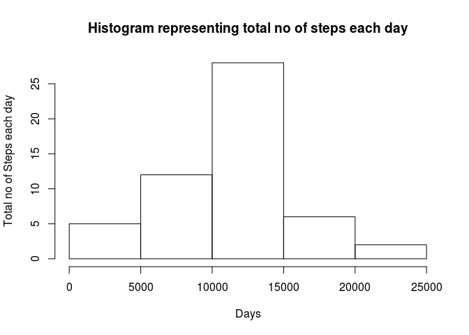
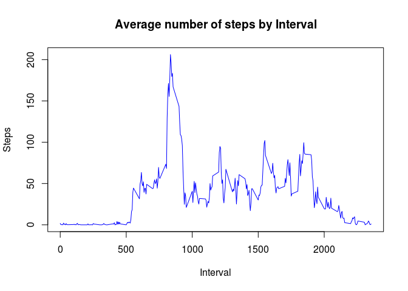
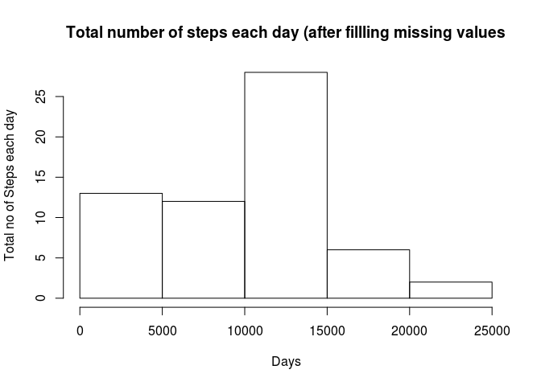
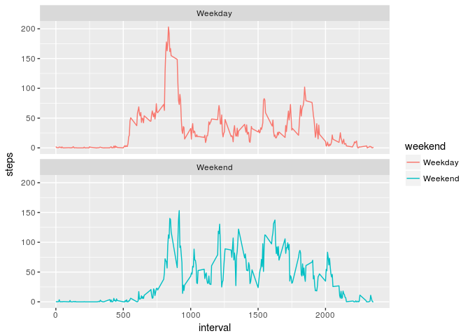

# Reproducible Research: Peer Assessment 1


## Loading and preprocessing the data

###1.Load the data (i.e. Read activity.csv file)

```r
library(dtplyr)
library(ggplot2)
data <- read.csv("~/Documents/activity.csv")
```
###2.Process /transform the data(if necessary) into a format suitable for analysis

```r
data$date<-as.Date(data$date)
data_WoNA <- data[complete.cases(data),]
```
## What is mean total number of steps taken per day?

```r
mean1 <-tapply(data_WoNA$steps,data_WoNA$date,mean)
```
###1.Make a histogram of the total no of steps taken each day

```r
steps_day <- aggregate(steps~date,data_WoNA,sum)
hist(steps_day$steps,xlab='Days',ylab='Total no of Steps each day',main='Histogram representing total no of steps each day')
```

<!-- -->
###2.Calculate and report the mean and median of total no of steps taken each day

```r
mean_stepsday <- mean (steps_day$steps)
median_stepsday <- median (steps_day$steps)
```
### Mean 

```r
mean_stepsday
```

```
## [1] 10766.19
```
### Median

```r
median_stepsday
```

```
## [1] 10765
```
## What is the average daily activity pattern?

###1.Make a timeseries plot of 5 min interval(x axis) and average no of steps taken , averaged across all days(y-axis)

```r
steps_interval<-aggregate(steps~interval,data_WoNA,mean)
plot(steps_interval$interval,steps_interval$steps,type='l',xlab ='Interval',ylab='Steps',col='blue',main='Average number of steps by Interval')
```

<!-- -->
###2.Which 5-minute interval ,on average across all the days in the dataset,contains maximum no of steps?
###Maximum no of steps are as following

```r
max <-steps_interval[which.max(steps_interval$steps),1]
cat("5min interval containing max no of steps is",max)
```

```
## 5min interval containing max no of steps is 835
```
## Inputing missing values

###1.Calculate and report the total no of missing values in dataset

```r
miss<- nrow(data)-nrow(data_WoNA)
cat("No. of missing values",miss)
```

```
## No. of missing values 2304
```
###2.Devise a strategy for filling in missing values in dataset
###3.Create a new dataset that is equal to original dataset but with missing values filled in

```r
colnames(steps_interval)[2]<-"Meansteps"
data_imputed <- merge (data, steps_interval)
avg_interval <- aggregate(steps~interval,data_imputed,mean)
data_imputed$steps[is.na(data_imputed$steps)] <- data_imputed$Meansteps
```

```
## Warning in data_imputed$steps[is.na(data_imputed$steps)] <- data_imputed
## $Meansteps: number of items to replace is not a multiple of replacement
## length
```

```r
data_avgstepsday <- aggregate(steps~date,data_imputed,sum)
```
###4.Make a histogram of the total no of steps taken each day and calculate mean and median no of steps taken per day

```r
hist(data_avgstepsday$steps,xlab='Days',main='Total number of steps each day (after fillling missing values',ylab='Total no of Steps each day')
```

<!-- -->

```r
m <- mean(data_avgstepsday$steps)
cat("Mean is ",m)
```

```
## Mean is  9371.437
```

```r
med <- median(data_avgstepsday$steps)
cat("Median is",med)
```

```
## Median is 10395
```
## Are there differences in activity patterns between weekdays and weekends?
###1.Create a new factor variable in dataset with 2 levels -weekday and weekend indicating whether a given date is a weekday or weekend day

```r
data_imputed$day <-weekdays (as.Date(data_imputed$date))
data_imputed$weekend <-factor(data_imputed$day,levels = c('weekday','weekend'))
data_imputed$weekend = ifelse(data_imputed$day %in% c("Saturday", "Sunday"), "Weekend", "Weekday")
a <- aggregate(steps~interval + weekend,data_imputed ,mean)
```
###2.Make a panel plot containg time series plot

```r
s <- ggplot(a,aes(x=interval,y=steps,color=weekend))+geom_line()+facet_wrap(~weekend,ncol=1,nrow=2)
print(s)
```

<!-- -->
